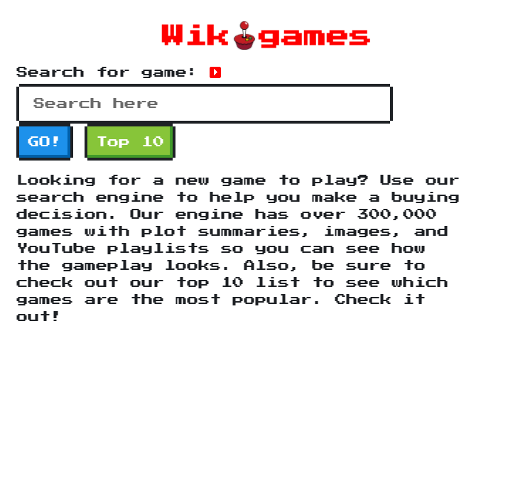

# Project 1 - Wikigames

### By Matt Kulling, Nicholas Vrtis, Mohammad Ali Karimi, and Zac Jayes

# What it does

Wikigames allows users to search from a wide range of games and receive back an image of the game, a brief description, and a YouTube playlist of gameplay so that users cna make an informed buying decision, or reminisce about their favorite retro games from the past. This website uses the RAWG games API for the game description and image, and the YouTube API for the YouTube modal and playlist. 

# Link to application

https://mokulling.github.io/wikigames/

# Screenshot of application

